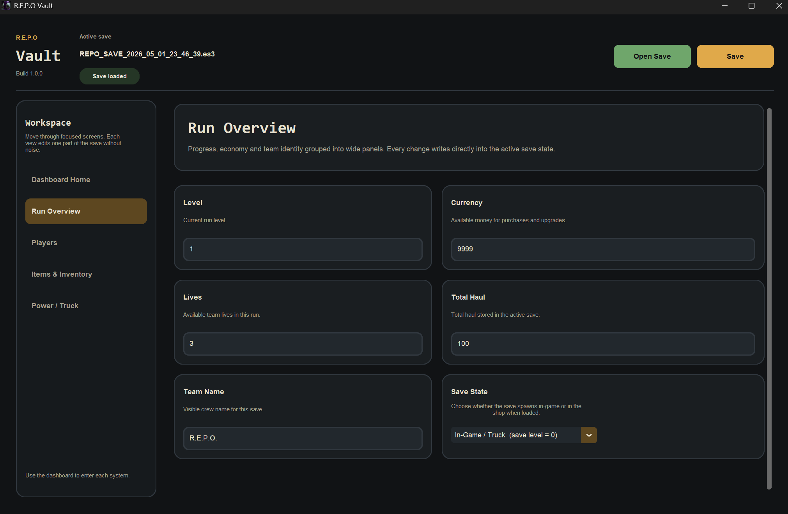
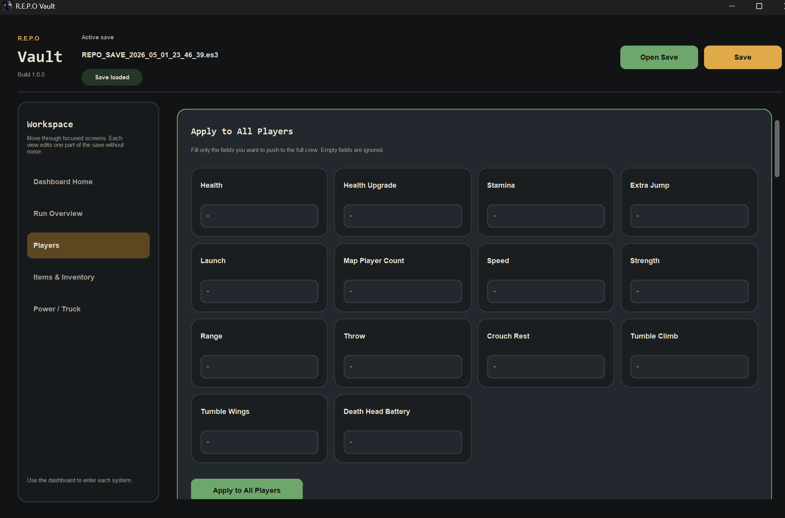
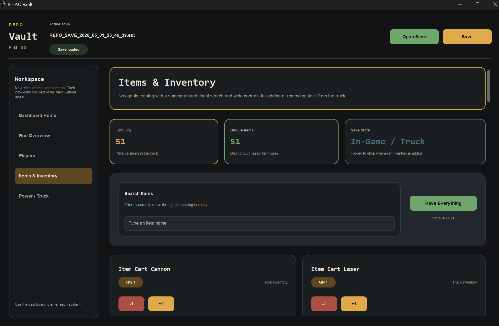
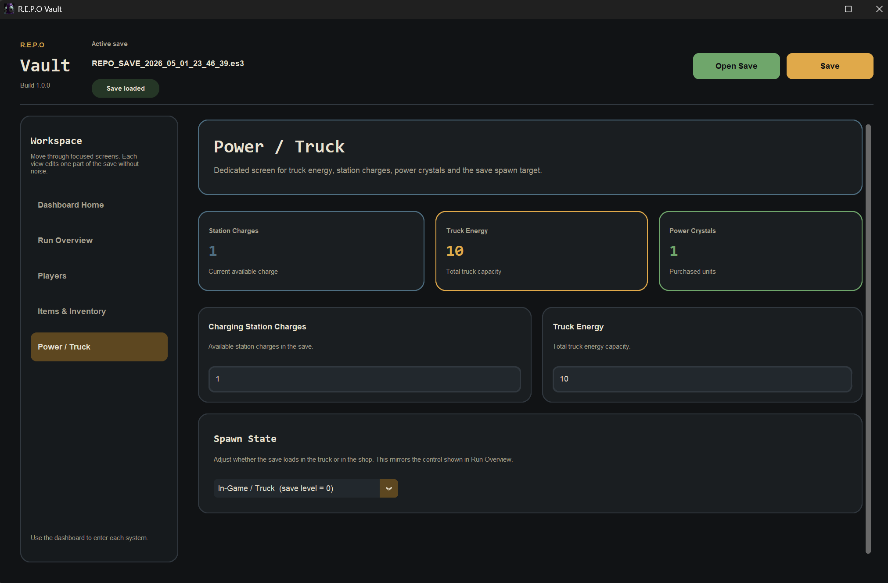

# R.E.P.O Vault

`R.E.P.O Vault` is a desktop save editor for `R.E.P.O` built with `CustomTkinter`.

It focuses on:
- fast editing of `.es3` saves
- a cleaner dashboard-driven UI
- player, item, and truck power management
- safe roundtrip save handling
- automated regression tests for core logic

## How to Use

1. Open the program.
2. Press `Open Save`.
3. Go to your `R.E.P.O` saves folder.
4. Open the `.es3` file that has the exact same name as its save folder.
5. Edit what you want in the app.
6. Press `Save`.

If you downloaded the release build, just run the `.exe`.

If you are running from source:

```powershell
.\.venv\Scripts\python.exe main.py
```

## Which Save File to Edit

`R.E.P.O Vault` edits the real `.es3` save file inside your `saves` folder.

On Windows, the default save location is:

```text
C:\Users\YOUR_USERNAME\AppData\LocalLow\semiwork\Repo\saves
```

Quick way to open it:

1. Open File Explorer.
2. Click the address bar.
3. Paste `%USERPROFILE%\AppData\LocalLow\semiwork\Repo\saves`
4. Press `Enter`.

Inside `saves` there should be one or more folders with names like:

```text
REPO_SAVE_2026_05_01_23_46_39
```

Inside each save folder, the file you should edit is the `.es3` file with the exact same name as the folder.

Correct example:

```text
C:\Users\YOUR_USERNAME\AppData\LocalLow\semiwork\Repo\saves\REPO_SAVE_2026_05_01_23_46_39\REPO_SAVE_2026_05_01_23_46_39.es3
```

Do not edit backup files.

Wrong examples:

```text
REPO_SAVE_2026_05_01_23_46_39_BACKUP1.es3
REPO_SAVE_2026_05_01_23_46_39.backup.es3
```

Rule of thumb:
- edit the `.es3` file that matches the folder name exactly
- do not edit files with `BACKUP` in the name
- do not edit `.backup.es3` files

## If You Cannot See `AppData`

`AppData` is usually hidden on Windows.

On Windows 11:

1. Open File Explorer.
2. Click `View`.
3. Click `Show`.
4. Enable `Hidden items`.

On Windows 10:

1. Open File Explorer.
2. Open the `View` tab.
3. Enable `Hidden items`.

## App Preview

### Dashboard Home


### Overview



### Players



### Items



### Truck



## Highlights

- Retro terminal inspired UI with a dashboard home and focused workspaces
- Steam avatar support with local cache fallback
- Faster item interactions: `+1`, `-1`, and `Have Everything` no longer rebuild the entire catalog
- Save compatibility preserved with the existing `.es3` format
- Built-in unit and smoke tests to catch regressions before shipping

## Project Layout

```text
main.py
repo_vault/
  app.py               Main desktop application shell
  constants.py         Runtime constants and environment-backed config
  env_bootstrap.py     Local .env loader
  hovercard.py         Tooltip binding shim
  inventory_logic.py   Pure item/inventory mutation logic
  items.py             Items & inventory UI
  oxide_cipher.py      Save encryption/decryption engine
  players.py           Players UI
  resources.py         Resource path + window icon helpers
  save_service.py      Save load/store service
  theme.py             Design tokens
  widgets.py           Reusable UI components
tests/
  test_app_logic.py
  test_inventory_logic.py
  test_save_service.py
  test_smoke.py
run_tests.py
```

## Requirements

- Windows
- Python `3.13`
- A virtual environment in `.venv`

Install dependencies:

```powershell
.\.venv\Scripts\python.exe -m pip install -r requirements.txt
```

## Configuration

The save password is now read from `.env`.

Current variable:

```env
REPO_VAULT_SAVE_PASSWORD=Why would you want to cheat?... :o It's no fun. :') :'D
```

Use `.env.example` as the template if you need to recreate the file.
## Running Tests

Preferred command:

```powershell
.\.venv\Scripts\python.exe run_tests.py
```

What the test suite covers:
- save load/store roundtrip
- core editor state helpers
- inventory mutation logic
- module import smoke checks

## Build the Executable

```powershell
.\.venv\Scripts\python.exe -m PyInstaller "R.E.P.O Vault.spec" --clean
```

## Publish a GitHub Release

This repository includes a GitHub Actions workflow that builds and publishes the Windows executable to GitHub Releases whenever you push a tag that starts with `v`.

Typical flow:

```powershell
git add .
git commit -m "Prepare release"
git push origin main
git tag v1.0.0
git push origin v1.0.0
```

What happens automatically after the tag push:
- GitHub Actions runs the test suite
- PyInstaller builds `R.E.P.O Vault.exe`
- GitHub creates a Release entry
- the release uploads both the `.exe` and a `.zip` version as downloadable assets

## Performance Notes

Recent performance-focused changes:
- removed the legacy top `File` menu
- item quantity changes now update only the affected card and summary counters
- search only reflows visible item cards instead of rebuilding the full catalog
- active save metadata is updated incrementally in the header

If future UI work feels slow, start by checking:
- repeated full-screen rerenders
- blocking network calls in visible views
- unnecessary widget destruction/recreation
- per-keystroke expensive logic inside `<KeyRelease>` bindings

## Safety Notes

- The `.es3` structure and compatibility password flow are preserved
- Save operations still use the same underlying encryption semantics
- Tests are intended to be run before packaging or sharing a new build
